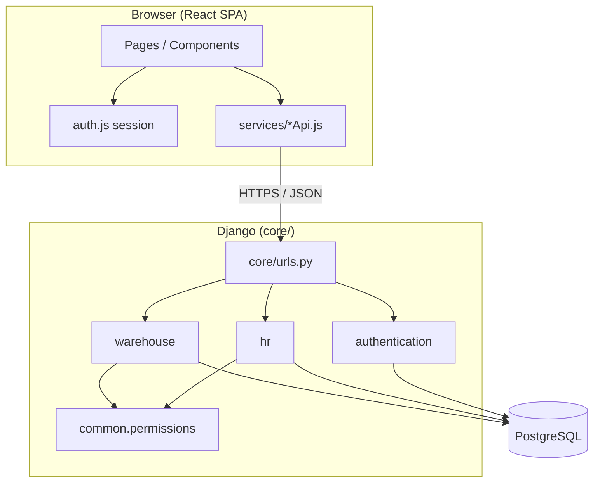

# System Architecture

## High-level overview

OPS System Management is a full-stack web application: a React SPA talks to a Django REST API backed by PostgreSQL. Authentication uses JWT (Simple JWT) with department-based routing on the frontend.



## Repository layout

| Path | Role |
|------|------|
| `core/` | Django project settings, root URL config, WSGI |
| `backend/authentication/` | Login, refresh, logout, `/me` |
| `backend/hr/` | Employee registration API |
| `backend/warehouse/` | Clients, batches, device scan/confirm |
| `backend/common/` | Shared permission classes |
| `backend/finance/` | Placeholder for future finance module |
| `frontend/` | Create React App UI |
| `docs/` | Architecture, ERD, workflows, decision log |

## API surface

| Prefix | Purpose |
|--------|---------|
| `auth/login/` | Issue access + refresh JWT; returns `department`, `full_name` |
| `auth/refresh/` | Refresh access token |
| `auth/logout/` | Blacklist refresh token |
| `auth/me/` | Current user profile |
| `hr/employees/` | HR operations (`mode=register_employee`) |
| `warehouse/clients/` | Client + batch workflows (single/bulk, base/linking steps) |
| `warehouse/devices/` | Device scan + confirm (`mode=scan` \| `confirm`) |
| `warehouse/clients/list/` | Client dropdown data |
| `api/schema/` | OpenAPI schema (drf-spectacular) |
| `api/docs/` | Swagger UI |

Interactive API docs: run the backend and open `http://127.0.0.1:8000/api/docs/`.

## Authentication and authorization

1. User logs in via `POST auth/login/` with username/password.
2. Response includes JWT access/refresh tokens plus `department` and `full_name`.
3. React stores tokens and department in `localStorage` (`utils/auth.js`).
4. `PrivateRoute` in `App.jsx` checks department before rendering `/hr/*` or `/warehouse/*`.
5. Backend views enforce permissions (`IsHRStaff`, `IsWarehouseAgent`) independent of the UI.

JWT access tokens embed `department` and `full_name` claims for client-side routing; the API still validates permissions server-side.

## Frontend structure

```
frontend/src/
├── components/     # JSX only — no colocated CSS
├── pages/          # Route-level page shells
├── services/       # API clients (axios)
├── styles/
│   ├── global/     # variables.css, index.css (imported once in index.js)
│   ├── pages/      # Page-level layouts (e.g. hr-dashboard.css)
│   └── components/ # Feature styles (e.g. bulk-workflow.css)
├── utils/          # auth session helpers
└── App.jsx         # React Router + protected routes
```

Create React App requires CSS to be imported from JS; centralizing files under `styles/` is a team convention, not a framework requirement.

## Backend layering

Warehouse and HR apps follow a thin-view pattern:

- **Views** (`views.py`) — parse `mode` / `step`, validate with serializers, delegate to services
- **Serializers** — request/response shape and validation
- **Services** (`services.py`) — business logic and database operations
- **Models** — persistence and relationships

## Tech stack (current)

- **Frontend:** React, React Router, axios, CSS
- **Backend:** Django 6, Django REST Framework, Simple JWT, drf-spectacular
- **Database:** PostgreSQL (via environment config in `core/settings.py`)
- **Planned:** Docker, Kubernetes, GitHub Actions CI/CD
