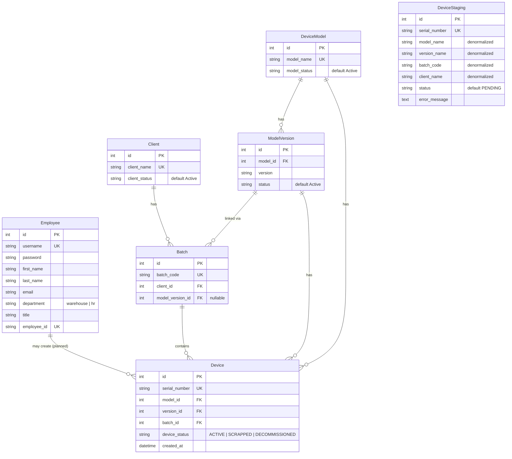

# Entity Relationship Diagram

This diagram reflects the current Django models in `backend/hr` and `backend/warehouse`. The finance app is reserved for future work and has no active models.

## Notes

- **Employee** extends Django `AbstractUser` and is the auth user model for JWT login.
- **DeviceStaging** intentionally avoids foreign keys during scan/validation; confirmed devices are promoted to **Device** with proper FK relationships.
- **Client**, **DeviceModel**, and **ModelVersion** use status fields instead of hard deletes to preserve audit history.
- **Batch** ties a client to a model version under a unique `batch_code`.
