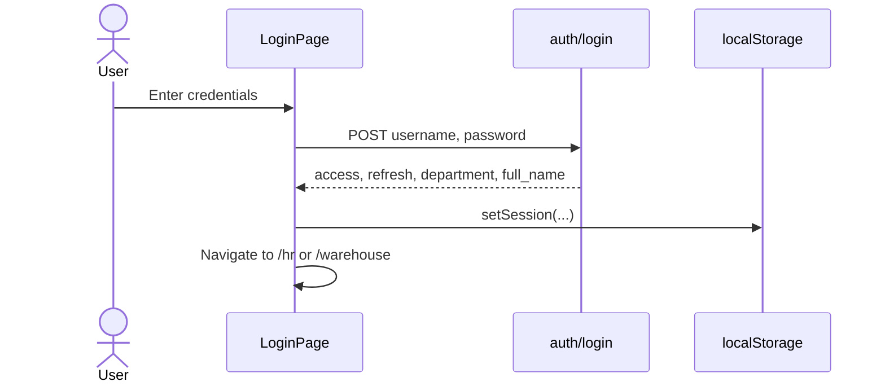
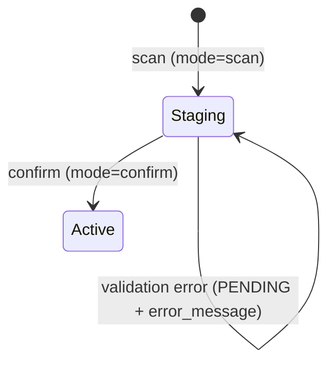

# Workflows and User Journeys

## Authentication flow

| Department | Dashboard route |
|------------|-----------------|
| `hr` | `/hr` |
| `warehouse` | `/warehouse` |

If a user hits a route for another department, they are redirected to `/unauthorized`. Expired or invalid tokens clear the session and send the user back to `/login`.

## HR: Register employee

**UI:** `HRPage` → `RegisterEmployeeForm`  
**API:** `POST hr/employees/` with `mode: "register_employee"`

1. HR user fills username, password, name, email, optional employee ID/title, and department (`warehouse` or `hr`).
2. Frontend calls `HRApi.registerEmployee`.
3. Backend validates with `EmployeeRegistrationSerializer`, creates user via `HRService.register_employee`.
4. Success message shown; form resets.

Requires `IsHRStaff` permission on the API.

## Warehouse: Client onboarding (bulk workflow)

**UI:** `BulkAddClientForm`  
**API:** `POST warehouse/clients/`

The client workflow is a two-step process controlled by `mode` and `step`:

### Step 1 — Base (`step: "base"`)

Creates clients and device models.

| Mode | Behavior |
|------|----------|
| `single_client` | One client + one model per request |
| `bulk_clients` | Array of client/model pairs in `clients[]` |

Response refreshes dropdown data for clients and models.

### Step 2 — Linking (`step: "linking"`)

Associates batch codes with clients and model versions.

| Mode | Behavior |
|------|----------|
| `single_client` | One batch + version link |
| `bulk_clients` | Array of links in `links[]` |

Requires `IsWarehouseAgent` permission.

## Warehouse: Device intake

**UI:** Device scan/confirm within warehouse workflow  
**API:** `POST warehouse/devices/`

### Scan (`mode: "scan"`)

1. Warehouse agent scans or enters a serial number.
2. `DeviceService.scan_device` validates against client/model/batch data.
3. A **DeviceStaging** row is created with denormalized names and `status=PENDING` (or error details if invalid).

### Confirm (`mode: "confirm"`)

1. Agent confirms a staged serial number.
2. `DeviceService.confirm_device` promotes the record to a **Device** with foreign keys to model, version, and batch.
3. Device status is set to `ACTIVE`.

Staging uses plain text fields (no FKs) so validation can run before committing relational data.

## API documentation workflow (developers)

1. Start Django: `python manage.py runserver`
2. Open Swagger UI at `/api/docs/`
3. Authenticate using a JWT from `auth/login/` (Bearer token) to try protected endpoints

Schema is generated from DRF views via **drf-spectacular** (`/api/schema/`).
